<!-- Generated from deck.html by to-markdown.mjs. Edit deck.html, not this file. -->

<!-- The Analyst Assessment — MISP -->

---

**MISP · Value Profile**

# The Analyst Assessment

What MISP makes of a value — and whose judgement that is.

---

**The problem**

## MISP tells you what is recorded. It never told you what to make of it.

Eight organisations reported this IP. There are 53 sightings, four of them false positives. It hits a warninglist. No galaxy is attached to it.

**So — is it a threat?**

Every analyst does this arithmetic in their head, every day, and no two do it the same way.

> Four independent organisations reported it is worth +28 to one analyst and +12 to another, and neither is wrong. — Why the engine could not simply ship weights

> An engine with the weights baked in would be a hidden editorial position shipped as arithmetic.

---

**The move**

The engine is a **mechanism**.
The judgement is a **document you own**.

> Two analysts looking at the same value cannot presently disagree in a way the system can express — one of them writes a note. With profiles the disagreement becomes an artefact: the same evidence, two profiles, two scores, and a ledger each that shows exactly which row diverged.

---

**What an assessment is**

## Three readings, not one score

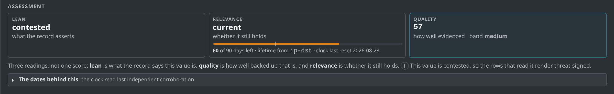

| Axis | The question it answers | Rendered as |
| --- | --- | --- |
| **Lean** | What does the record assert this value is? | `threat` · `benign` · `contested` · `none` |
| **Relevance** | Does that assertion still matter today? | `current` · `aging` · `expired` · `timeline uncertain` |
| **Quality** | How much can the record be trusted? | a number, with the ledger as its audit trail |

---

**Axis one**

## Lean — read, not invented

`to_ids` is the community's explicit, per-occurrence, machine-readable vote that a value is an actionable indicator. It is already in the database and IDS exports already filter on it.

Reading it makes the lean a **report of the community's assertion** instead of an invented judgement.

Lean is categorical and timeless. A malware hash leans `threat` forever; time cannot move it, only new assertions can.

| Lean | When |
| --- | --- |
| `none` | no occurrences |
| `threat` | threat assertions dominate |
| `benign` | no threat assertion, or false-positive evidence dominates, or a `false_positive` warninglist hit carries it |
| `contested` | a conflict rule fires, or the `to_ids` stance splits beyond tolerance |

> `to_ids` is noisy in practice — per-type defaults, wholesale feed imports, orgs that never curate it. The three axes absorb that instead of being corrupted by it: lean reports what the record asserts, and **quality is where sloppy assertions get graded**. One uncurated org's `to_ids = 1` is a threat lean with low quality; four independent orgs deliberately confirming is the same lean with high quality.

---

**Axis two**

## Relevance — the clock, quarantined

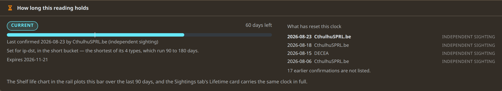

*Everything temporal lives here: the per-type TTL, the last-independent-corroboration clock, expiry, the runway. The clock never touches the lean.*

**Fresh corroboration** makes the assessment more current; expiry makes it less. Which corroborations reset the clock is listed, with dates and who filed them.

**Temporal precision is an input.** No `first_seen`, a large created-to-published lag, a timestamp standing in for an observation date — each degrades relevance to `timeline uncertain` and deducts from quality.

---

**Axis three**

## Quality — the score is its own explanation

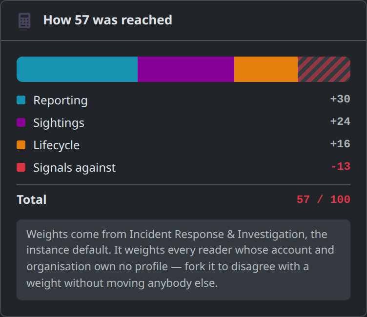

Contributions sum to the score. Exactly.

Nothing is normalised, calibrated or post-processed. There is no second code path that could disagree with the ledger — the sum *is* the number, by construction.

That is what makes a profile diff renderable, and what lets a reader argue with one row instead of with a black box.

The number claims something narrow: not *how malicious*, but **how much corroborated, attributed, temporally precise weight stands behind the record**.

---

**A real value · this instance, today**

## 8.8.8.8

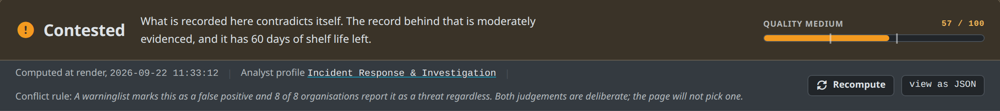

*The hero names the reading, the number, the band, the profile that weighted it, and — here — the rule that decided it.*

> “Both judgements are deliberate; the page will not pick one.” A contradiction between a warninglist and eight reporting organisations is not an error to be netted off in arithmetic. It is the finding.

---

**8.8.8.8**

## How the reading was decided

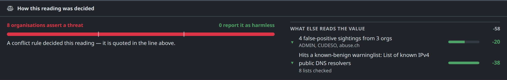


*Category `false_positive` means reports about this value are usually collateral — the sample really did touch it, and it is still not the indicator. It does not say the reporting organisations were wrong about their incidents.*

---

**8.8.8.8**

## The ledger — every row a reader can argue with

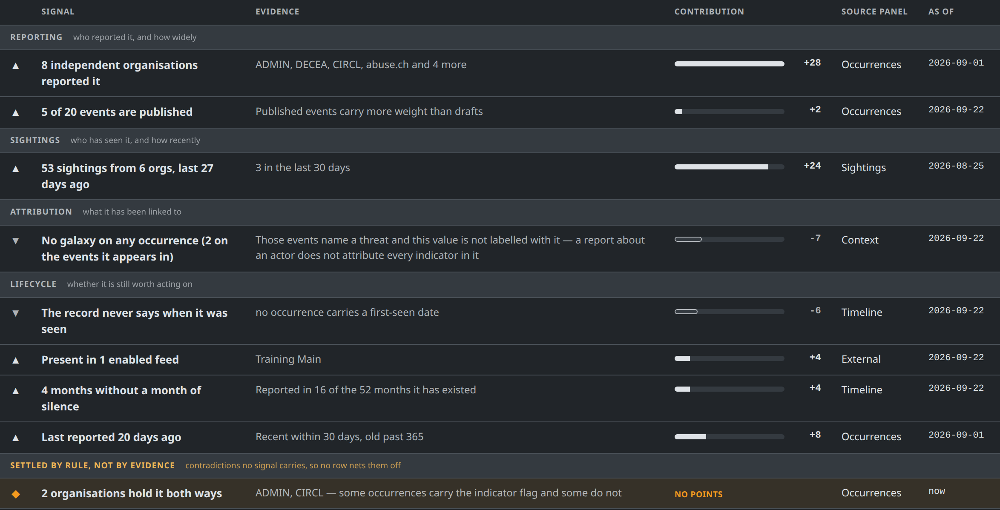

> Claim · evidence · contribution · **which panel to go and argue with it in** · as of when. The last group, *settled by rule, not by evidence*, carries contradictions no signal owns — so no row quietly nets them off.

---

**8.8.8.8**

## It tells you what would change its mind

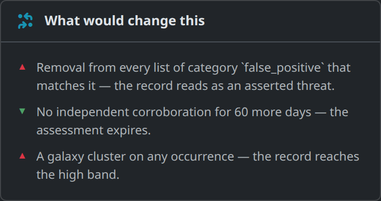

An assessment that cannot be falsified is an opinion.

Because the score is a sum of declared weights over declared evidence, the engine can work backwards: **name the evidence that would move the reading, and by how much**.

Signals that are linear in a countable unit declare it, so the card can say *“two more organisations reporting it”* instead of *“fourteen more points”*.

---

**Same engine, same instance**

## Three more values

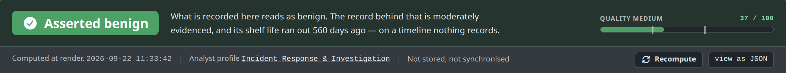

*`google.com` — **asserted benign**. Four orgs, three sightings, no threat assertion standing.*

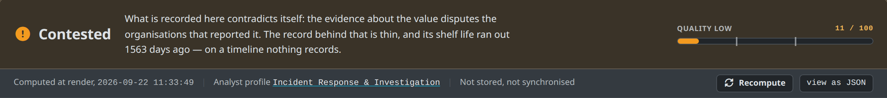

*`45.155.205.233` — **contested**, and by a different road: three false-positive sightings filed against a threat assertion. No warninglist involved.*

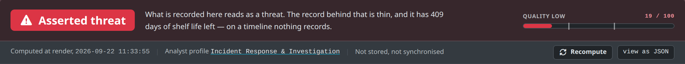

*An md5 — **asserted threat**. Three orgs, galaxy attribution, thin sighting history. A low number under a confident lean is the honest answer, not a contradiction.*

---

**The signals**

## Twelve shipped, five groups

| Signal | Group | What it reads | Default points |
| --- | --- | --- | --- |
| `reporting.independent_orgs` | Reporting | distinct organisations holding an occurrence | `per_org 7`, `cap 28` |
| `reporting.published_ratio` | Reporting | published events versus drafts | `scale 9`, `none −2` |
| `sightings.volume_recency` | Sightings | sighting count, org spread, recency | `cap 24`, `none_recent −4` |
| `sightings.false_positive` lean | Sightings | false-positive sightings and their org spread | `per −3`, `per_extra_org −4`, `cap −26` |
| `attribution.galaxy` | Attribution | galaxy clusters on this value's own occurrences | `per_cluster 7`, `cap 21`, `absent −7` |
| `attribution.technique` | Attribution | ATT&CK techniques | `per_technique 3`, `cap 9` |
| `lifecycle.warninglist` lean | Lifecycle | a warninglist hit and its category | `no_hit 6`, `false_positive_hit −38`, `known_hit 0` |
| `lifecycle.feeds` | Lifecycle | presence in enabled feeds | `per_feed 4`, `cap 8`, `no_feed −2` |
| `lifecycle.continuity` | Lifecycle | months without a gap in activity | `per_month 1`, `cap 12` |
| `lifecycle.recency` | Lifecycle | how recently it was reported | `recent 8`, `old −4` |
| `record.temporal_precision` | Lifecycle | `first_seen` presence, encoding lag | `dated 4`, `undated −6` |
| `enrichment.answer` lean | Enrichment | stored answers from enrichment modules | `per_verdict 12`, `cap 24` |

> `known_hit` is **zero** by design. A `known`-category hit says *this is shared infrastructure*, not *this is harmless*: the row belongs on the page, counted for neither side, and a conflict rule names its contradiction with wide reporting rather than netting it off.

---

**The contract**

## A signal returns a row, not a number

Only the signal knows how to say *“53 sightings from 6 orgs, last 27 days ago”* and put *“3 in the last 30 days”* underneath it.

**The implementation owns the sentence. The profile owns the points.**

Points are declared **threat-signed**: does this evidence point at a threat, and how hard. The author never thinks about which way the arrow renders — the engine anchors the lean rows to the lean's polarity at assembly.

Quality rows keep their declared sign whatever the lean, because *how much record there is* is the same question whatever the record concluded.

```json
{ "id": "reporting.independent_orgs",
  "group": "Reporting",
  "enabled": true,
  "trust_weighted": true,
  "points": { "per_org": 7, "cap": 28 },
  "config": { "named": 4 } }
```

> `points` is what evidence is worth; `config` is the implementation's thresholds. Neither has a fixed schema — each class declares its own keys, and validation runs per implementation on save.

---

**Honest states**

## Four outcomes, and a word for each

### Fired

A ledger row. The normal case.

### Silent

Evaluated, nothing to say, no row. A ledger listing everything that did not happen is unreadable.

### Could not run

Named in `not counted`, with the reason. Excluded by policy, or blocked by permissions, or no data.

### Unknown id

A profile naming a signal this instance does not have. Named, never dropped.

**Absent because excluded is not absent.** A signal whose input set was emptied by an exclusion stays silent rather than firing its absence key — zero sightings because `sightings.self` removed them all is not a value nobody sighted.

> A score computed from eight of nine configured signals and presented as if nine ran is exactly the kind of quiet lie this feature forbids. The hero still names the profile, because the profile *was* the thing that weighted the assessment — imperfectly.

---

**Cost**

## The budget is evidence time, never a stopwatch

Every signal reads one shared context, built once per assessment — the occurrence tally, the sighting rows, the tag and galaxy sets, the warninglist result, the corroboration dates. One query pass, not twelve.

Each signal declares its **evidence class**:

- **Aggregate** — counts and dates. Index aggregates, cheap at any cardinality, computed whole-history, always.
- **Row** — the material signals quote in their prose. This is what a window bounds, because rows were the cost.

| Value | What happens |
| --- | --- |
| Normal | Everything. No budget in play, no note on the page. |
| Long history | Row evidence fetched for the last 90 days only — and said so, as profile policy, linked to the editor. |
| Too hot | Row-hungry signals are not evaluated and land in `not counted`. The assessment is computed from the signals that can still run. |

> Row caps and wall-clock budgets were rejected on determinism: the page, the simulator and the export worker all compute this and must agree. A row cap scores whichever rows the query happened to return; a stopwatch scores by server load.

---

**Configuration**

## Which profile is scoring you

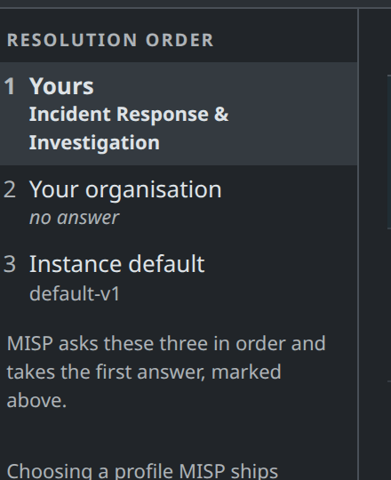

Nearest owner wins.

MISP asks three questions in order and takes the first answer: your own profile, then your organisation's, then the instance default. Exactly one profile is in force for any (reader, value) pair — which is what lets the page name it.

**A fork is a full copy** with a fresh uuid and no memory of its parent. An improved default never reaches an existing fork — which is why every map in a profile is an override set: a fork that overrides nothing keeps tracking what it came from.

**Editing the instance default is a site-admin act.** For an ordinary analyst, fork is the path — and it is one click.

---

**Configuration**

## What a profile contains

| Section | What the analyst decides | Axis |
| --- | --- | --- |
| `signals` | which signals run, and what each contributes | lean + quality |
| `thresholds` | where the bands sit, and the lean's supermajority | lean + quality |
| `escalations` | named rules that emit `contested` instead of contributing points | lean |
| `exclusions` | evidence set aside *before* scoring — self-sightings, mirrored feeds, the long-history window | quality |
| `relevance` | the clock, the per-type TTLs, the precision tripwires | relevance |
| `reference` | what you believe about your sources: org trust, which warninglists mean *shared infrastructure* rather than *false positive* | quality |
| `enrichment` | which modules this profile cares about, per type, and whether it will contact third parties | context |

**Empty means “as before”.** Every map is an override set — an empty org-trust map weights all organisations equally. The feature changes no behaviour until somebody edits something.

> A profile cannot widen instance policy: it picks enrichment modules from the set the instance already enabled. And presentation stays out — a version bump on the object that explains a score should never mean somebody changed their default tab.

---

**Configuration**

## Five profiles ship, for five ways of working

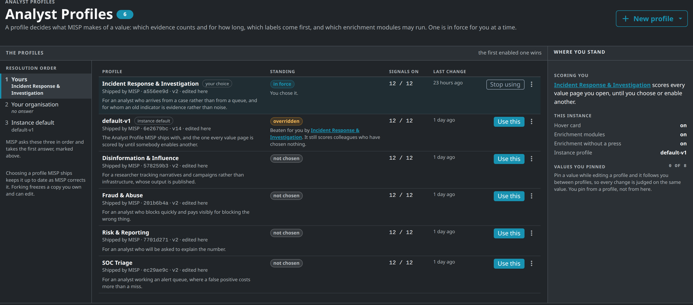

> Deliberately conservative: all five keep the shipped default's weights and bands. What moves is **shelf life** and **what the page shows first** — Fraud & Abuse expires an IP in 14 days where Incident Response gives a hash five years, and Risk & Reporting changes no number at all. Choosing one MISP ships keeps it corrected upstream; forking freezes a copy you own.

---

**Configuration**

## The editor: every weight, in one place

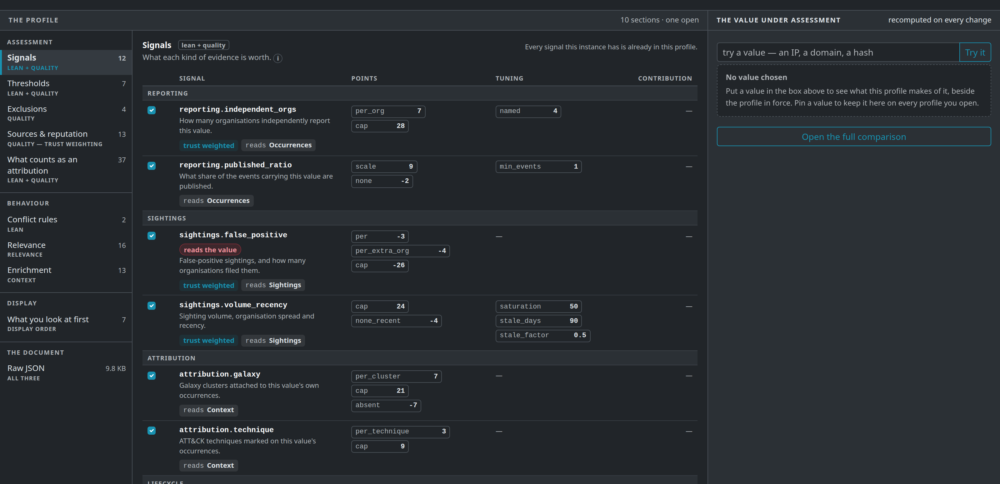

*Ten sections down the left. Each signal carries its points, its tuning, whether it is trust-weighted, which panel it reads, and whether it reads the value or weighs the record.*

---

**Configuration**

## Change a weight; see every row that moved

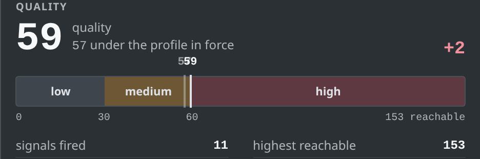

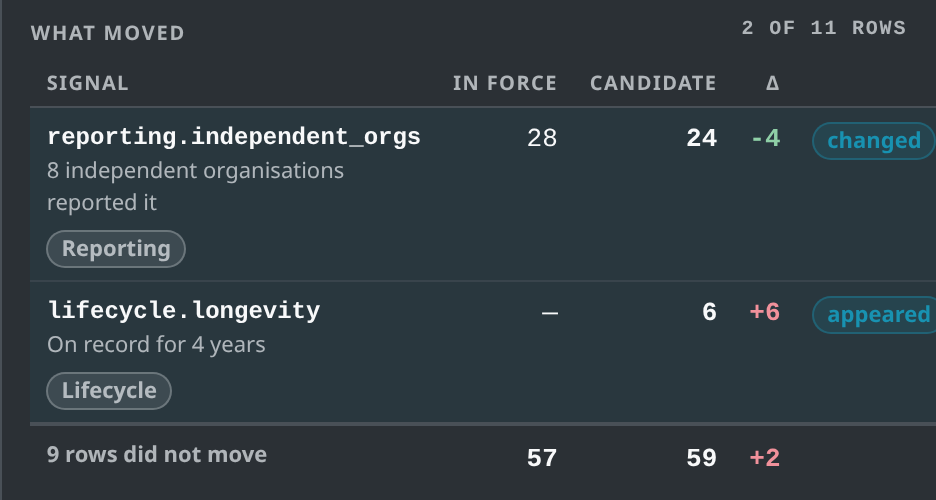

Put a value on the bench and it is rescored as you type, against the profile in force. Here `independent_orgs` went from 7 points an organisation to 3 (−4), and a signal that was not in the profile was switched on (+6).

**Two of eleven rows moved. Nine did not** — and the page says which, and by how much, before you save anything.

> Pin a value and it follows you between profiles, so every change is judged on the same evidence.

---

**Extending**

## A new signal is a file, not a release

Nothing about the catalogue is hardcoded. The twelve shipped signals are twelve files; a thirteenth is a thirteenth file. The code that would have held a list of them does not exist.

| Directory | Holds | On upgrade |
| --- | --- | --- |
| `app/Model/ValueSignals/` | the shipped catalogue | replaced |
| `app/Lib/ValueSignals/` | what you drop in | never touched |

> The same shape MISP already uses twice — `Workflow`'s two module roots and the decaying-model formula directory.

1. **Discovery is not activation.** A dropped file changes no score until a profile names its id. Otherwise copying a file would move every number on the instance with no edit to any profile.
2. **A colliding id is refused, not overridden.** The shipped signal keeps the id. Two instances rendering one ledger row from two different computations is the failure mode worth preventing.
3. **A broken file is an honest state.** Does not parse, wrong base class, `evaluate()` throws, row malformed: logged, skipped, named in `not counted`. Never a fatal.
4. **One scan per request, no cache.** An admin who drops a file expects the next page load to see it.
5. **Nothing in the UI ever writes one of these files.** No upload, no in-browser editor. Signals arrive the way you already deploy code.

---

**Extending**

## Writing one

The judgement this encodes: a value first reported nine years ago *and still being reported* is a different thing from one that appeared last week.

The catalogue scores how *recently* a value was reported and how *continuously*. Nothing scores how long it has stood.

The two schemas are what let the editor render a form for a signal it has never seen. Without them a drop-in is only half usable — the admin has to hand-edit JSON to configure the file they just wrote.

> Whole file: `example/LifecycleLongevity.php`

```php
class LifecycleLongevity extends ValueSignalBase
{
    public $id    = 'lifecycle.longevity';
    public $group = 'Lifecycle';
    public $reads = array('occurrences');

    public function __construct()
    {
        $this->description = __('How long this has been on record.');

        // The editor builds a form from these two.
        $this->points_schema = array(
            'established' => array('type' => 'int', 'default' => 6),
            'brief'       => array('type' => 'int', 'default' => -2));
        $this->config_schema = array(
            'established_days' => array('type' => 'int',
                                        'default' => 365));
    }

    public function evaluate(array $context, array $config)
    {
        $oldest = (int)($context['occurrences']['oldest'] ?? 0);
        if ($oldest === 0) { return null; }        // silent

        $days = (int)floor(($context['now'] - $oldest) / 86400);
        $up   = $days >= $this->setting($config, 'established_days');

        return $this->row(
            $this->points($config, $up ? 'established' : 'brief'),
            sprintf(__('On record for %s'), $this->span($days)),
            __('Established once it has stood for 365 days'),
            $context,
            $this->stampAsOf($oldest, $context));
    }
}
```

---

**Extending**

## Drop it in — two page loads later

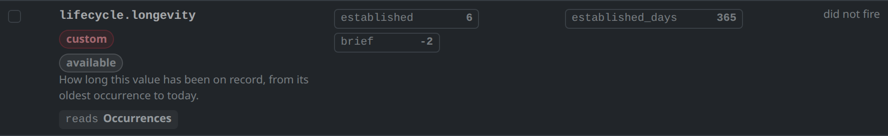

*The editor discovered it and built its form. **custom** — added here, so a colleague reading this profile elsewhere cannot reproduce the number it contributes. **available** — this instance has it; this profile does not use it yet.*

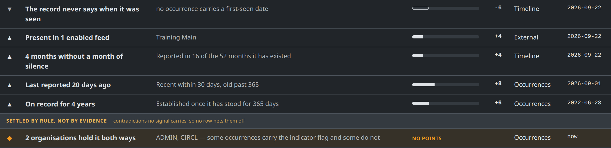

*Tick it in a profile and it scores real values, in its own prose, indistinguishable from the twelve MISP ships.*

---

**Where this stands**

## What is done, and what is not

**Working today.** The three axes, the twelve signals, the ledger and its exact sum, conflict rules, exclusions, the relevance clock, org trust, the six profiles, the editor, the bench, and the drop-in directories for signals and conflict rules.

**Still landing: the export gate.** The profile's TTL does not gate `restSearch` yet. The design is a materialised *instance* assessment — a worker stores one row per value under the instance default, and `restSearch` filters that row, which is the status-flip model the industry already runs. It waits on the `value_assessments` table.

> Per-analyst export gating is deliberately not the plan: a worker has to pick its profile before any caller exists.

> Two analysts looking at the same value can now disagree in a way the system can express.

**Try it on your own instance.**

- Open any value's *Assessment* tab and read the ledger before you trust the number.
- *Analyst Profiles* → pick the one that matches how you work, or fork and argue with a weight.
- Pin the three values you always end up explaining, and judge every change on them.
- If the twelve do not say what your team means, the thirteenth is a file.
